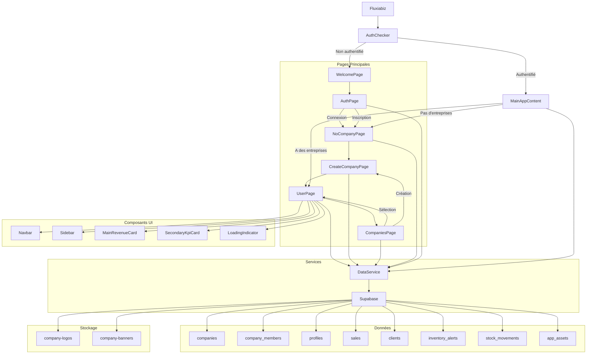

# Diagramme d'Architecture de Fluxiabiz

## Légende

- **Pages Principales** : Les différentes pages de l'application
- **Composants UI** : Composants réutilisables de l'interface utilisateur
- **Services** : Services pour interagir avec le backend
- **Données** : Tables de la base de données Supabase
- **Stockage** : Stockage d'objets pour les images

## Flux Principal

1. **Authentification** : L'utilisateur commence sur `AuthChecker` qui vérifie l'état d'authentification
2. **Connexion/Inscription** : Si non authentifié, l'utilisateur passe par `WelcomePage` → `AuthPage`
3. **Gestion d'entreprise** : Après authentification, l'utilisateur est dirigé vers :
   - `NoCompanyPage` s'il n'a pas d'entreprise (puis `CreateCompanyPage`)
   - `UserPage` s'il a une entreprise active
4. **Navigation** : L'utilisateur peut naviguer entre les entreprises via `CompaniesPage`

## Architecture Technique

- **Frontend** : Flutter avec des composants réutilisables
- **Backend** : Supabase (authentification, base de données, stockage)
- **Services** : `DataService` centralise les appels à Supabase
- **Données** : Tables relationnelles avec des relations entre entreprises, utilisateurs et activités